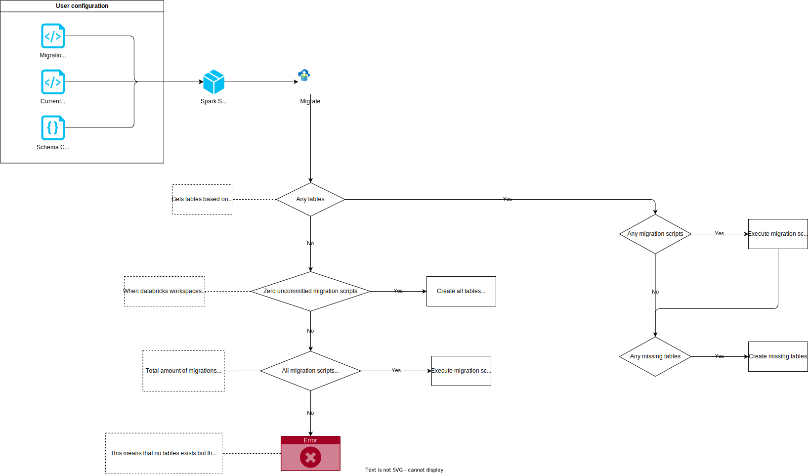

# Spark SQL Migrations



## Usage

```python

from spark_sql_migrations import (
    create_and_configure_container,
    migration_pipeline,
    SparkSqlMigrationsConfiguration,
)

from pyspark.sql.types import (
    StructType,
    StructField,
    StringType,
)

schema = StructType(
    [
        StructField("column1", StringType(), False),
        StructField("column2", StringType(), False)
    ]
)

substitutions = {"{location}": "some_location"}

spark_config = SparkSqlMigrationsConfiguration(
    migration_schema_name="schema_name",
    migration_table_name="table_name",
    migration_scripts_folder_path="migration_scripts_folder_path",
    table_prefix="table_prefix",
    substitution_variables=substitutions,
    catalog_name="spark_catalog",
)

create_and_configure_container(spark_config)
migration_pipeline.migrate()


```

### Folder Structure Example

```plaintext
├── current_state_scripts/
    ├── schemas
        ├── create_schema_1.sql
        ├── create_schema_2.sql
        └── ...
    └── tables
        ├── create_table_1.sql
        ├── create_table_2.sql
        └── ...
    └── views
        ├── create_view_1.sql
        ├── create_view_2.sql
        └── ...

└── migration_scripts/
    ├── 202001021700_migration_1.sql
    ├── 202002152030_migration_2.sql
    ├── 202010112145_migration_3.sql
    └── ...
```

The `current_state_scripts` folder contains SQL script files that are used to create the initial schema, tables and views for the application.

The core of the Schema Migration functionality relies on a designated folder named `migration_scripts` and a Databricks table named `executed_migrations`.
The `migration_scripts` folder serves as the repository for SQL script files, and ensures chronological execution order by their filenames
following the format "{year}{month}{date}{time}_{description}".

The paths should be provided in the `SparkSqlMigrationsConfiguration`:

- `migration_scripts_folder_path`
- `current_state_schemas_folder_path`
- `current_state_tables_folder_path`
- `current_state_views_folder_path`

## Current State

The purpose of the `current step` concept is to be able to create schemas, tables and views that might have been
deleted for some reason, even though they have been created by the normal migration process.

In the `SparkSqlMigrationsConfiguration` class, there are two fields that are used to define the folder path of the
schemas and tables that are part of the `current step`:

- `current_state_schemas_folder_path`: The folder path to SQL scripts that creates all schemas.
- `current_state_tables_folder_path`: The folder path to SQL scripts that creates all tables.
- `current_state_views_folder_path`: The folder path to SQL scripts that creates all views.

The `current step` is executed when there are missing schemas or tables in the Catalog, based on the `schema_config` field in the
`SparkSqlMigrationsConfiguration` class.

## SQL Script format

When creating SQL scripts for the Schema Migration functionality, it is crucial to adhere to a specific format to ensure consistency, readability, and proper execution. Below are the guidelines for the SQL script format:

1. **Script Naming Convention**
    - Follow the format **"{year}{month}{date}{time}_{description}"** for script filenames.
    - Example: "202001021700_migration_1.sql"
2. **Query Separation**
    - Separate individual SQL queries with a "GO" command on a new line.
3. **Comments**
    - Include descriptive comments to explain the purpose and functionality of each section or query.
    - Use comments to provide context, especially for complex or critical queries.
4. **Substitutions**
    - Use substitutions sparingly, limiting them to dynamic values that require flexibility, such as schema, prefix and file storage locations.

### Example SQL Script

```sql
-- 202001021700_migration_1.sql

-- Description: Create the initial schema and tables for the application

CREATE SCHEMA IF NOT EXISTS {bronze_schema}
COMMENT 'This is just an example'
LOCATION {bronze_location}

GO

CREATE TABLE IF NOT EXISTS {bronze_schema}.{prefix}test_table (column1 STRING, column2 STRING) USING delta

GO
```

## Metadata handling

The schema migration functionality are handling the metadata. Handling the metadata is not as straight forward
as it might seem. The reason for this is that the metadata is stored in Databricks, but the actual
data is stored in Storage Accounts.

This means that the Databricks instance could be taken down and restored. In such case the schema migration
functionality should be able to handle this, by restoring the metadata in the Databricks instance.

There is some known scenarios that the schema migration functionality should be able to handle. These are:

| Scenario                                            | Description                                                                                                                                                                                                           | Action                                                                            | Implemented |
|-----------------------------------------------------|-----------------------------------------------------------------------------------------------------------------------------------------------------------------------------------------------------------------------|-----------------------------------------------------------------------------------|-------------|
| <strong>Databricks instance re-established</strong> | Meaning all metadata are gone.                                                                                                                                                                                        | All migrations are run                                                            | ✅           |
| <strong>Schemas and Tables deleted</strong>         | All schemas and tables are deleted except the migrations tables, meaning that all migrations seems to have been run                                                                                                   | Create schemas and tables by the current state scripts                            | ✅           |
| <strong>Migration table deleted</strong>            | The migration table is deleted but all tables exists.                                                                                                                                                                 |                                                                                   |             |
| <strong>Some schemas/tables are deleted</strong>    | When some schemas/tables have been manually deleted                                                                                                                                                                   | Create missing schemas and/or tables                                              | ✅           |
| <strong>No tables but new migrations</strong>       | When 0 tables exists, but for some reason there is between 0 and max amount of scripts not executed. This case can happend if all metadata is removed and a Pull request has been pushed to main with a new migration | Throws an exception. [See manually action](#no-tables-but-new-migrations)         | ✅           |
| <strong>Missing table and migrations</strong>       | When one or more tables are missing and there is some uncommitted migrations                                                                                                                                          | Run the migrations, check for missing tables and create if they are still missing | ✅           |

### No tables but new migrations

When there are no tables but new migrations, it means that not all migrations are uncommitted, but some are.
This should not be possible, which is why an exception is thrown. However, it can be possible if the metadata
has been deleted and new migration scripts have been pushed to main. Then it will see that there are 0 tables in the metadata
but there is 1 uncommitted migration (when more than 1 exist) which does not make sense.

In this case, the user should do the following:

1. Go to the `Schema_Migration` job
2. Change the GitHub Tag to the previous release git tag (before the new migration(s) were added)
3. In `Tasks` change the `Dependant libraries` to the previous python wheel.
The Python wheel contains the pull request number just like the Git tag.
